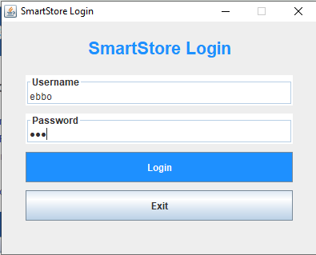
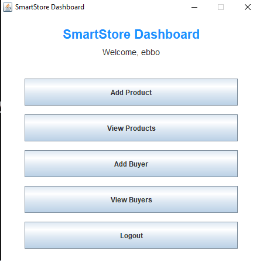
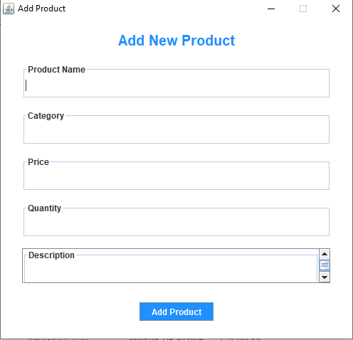
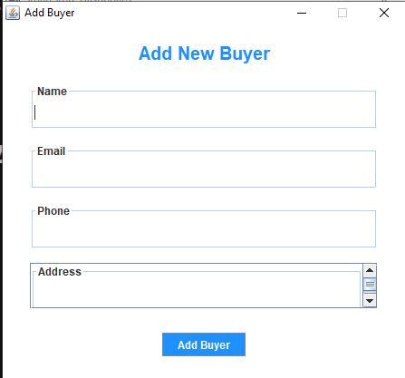
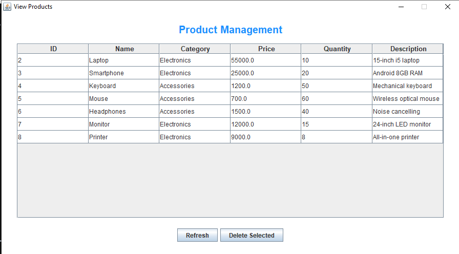
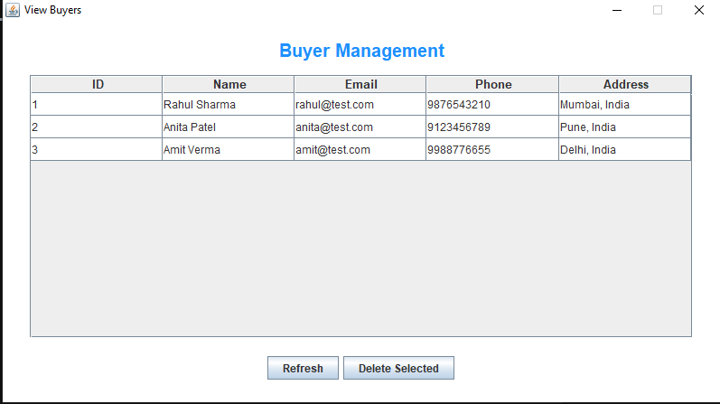

# 🛒 SmartStore Management System  
### Task 5 – Add and Delete Products/Buyers

---

## 📌 Project Overview

SmartStore is a Java Swing-based desktop application designed to manage products and buyers using MySQL and JDBC.

This project implements core CRUD operations (Create, Read, Delete) with proper validation, confirmation dialogs, and structured architecture following clean design principles.

---

## 🚀 Features

### 🔐 1. Authentication
- Login system connected to MySQL
- Credential verification using `PreparedStatement`
- Secure parameterized queries
- Error handling for invalid login attempts

---

### 📦 2. Product Management
- Add new products
- Fields:
  - Name
  - Category
  - Price
  - Quantity
  - Description
- Input validation:
  - Required field validation
  - Numeric validation for price and quantity
  - Prevents negative values
- View products in non-editable JTable
- Delete single product
- Bulk delete support
- Confirmation dialog before deletion
- Auto-refresh after operations

---

### 👥 3. Buyer Management
- Add new buyers
- Fields:
  - Name
  - Email
  - Phone
  - Address
- Email format validation
- View buyers in structured table format
- Bulk delete support
- Confirmation dialog before deletion
- Auto-refresh after operations

---

## 🏗 Project Structure

inventoryManagementSystem
│
├── DatabaseConnection.java
├── LoginForm.java
├── HomePage.java
│
├── model
│ ├── Product.java
│ └── Buyer.java
│
├── dao
│ ├── ProductDAO.java
│ └── BuyerDAO.java
│
└── ui
├── AddProductForm.java
├── ViewProductsForm.java
├── AddBuyerForm.java
└── ViewBuyersForm.java

---

## 🧠 Design Principles Used

- DAO Pattern (Data Access Object)
- Separation of UI and Database Logic
- MVC-like layered structure
- Proper Exception Handling
- Non-editable JTable implementation
- Confirmation dialogs for destructive actions

---

## 🛠 Tech Stack

- Java (Swing)
- MySQL
- JDBC
- NetBeans IDE

---

## 🗄 Database Setup

**Database Name:** `store_db`

### Tables:
- `users`
- `products`
- `buyers`

The file `store_db.sql` is included to recreate the database with sample data.

---

## ▶️ How to Run

1. Start MySQL Server.
2. Execute `store_db.sql` in MySQL.
3. Open the project in NetBeans.
4. Run `LoginForm.java`.

---

## 🔑 Sample Login

Username: ebbo
Password: 123

---

## 📸 Screenshots

### 🔐 Login Page

### 🏠 Dashboard

### ➕ Add Product

### ➕ Add Buyer

### 📦 View Products

### 👥 View Buyers

---

## 🎯 Conclusion

The SmartStore Management System successfully fulfills all Task 5 requirements including:

- Adding products and buyers
- Viewing records in structured tables
- Validating input fields
- Secure database integration
- Bulk deletion with confirmation
- Clean project architecture

The system demonstrates proper separation of concerns, secure database handling, and user-friendly UI design suitable for academic submission and internship-level demonstration.

---