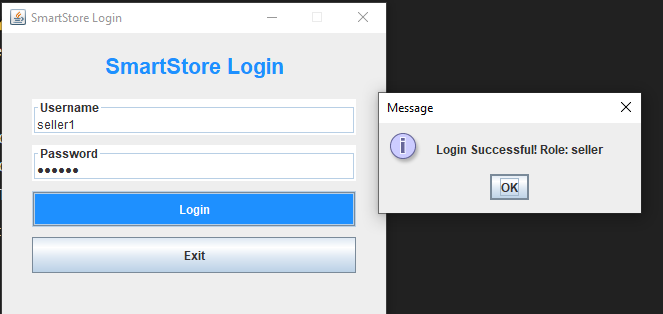
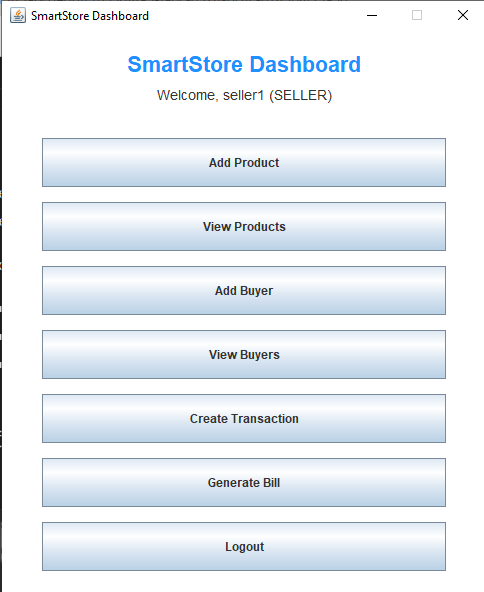
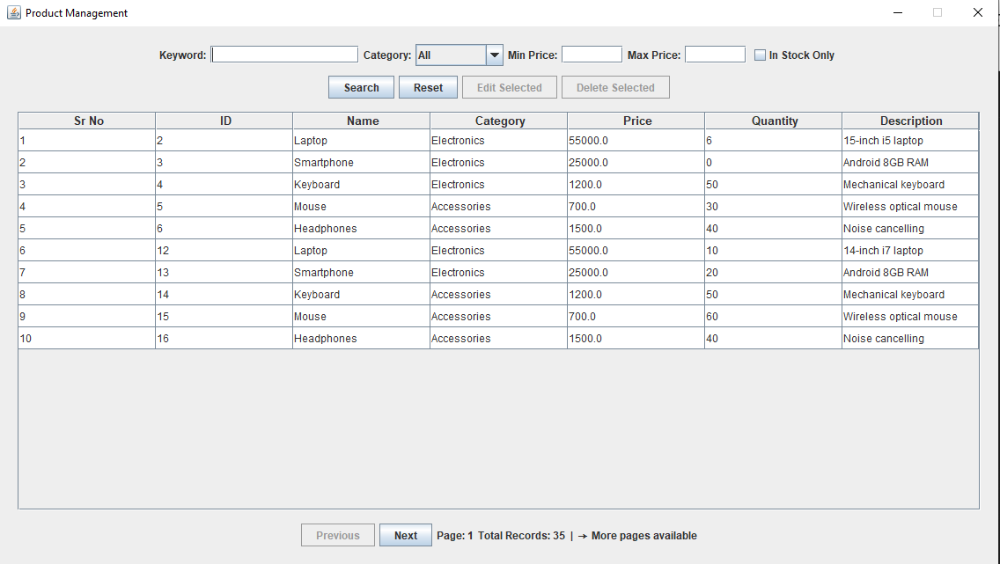
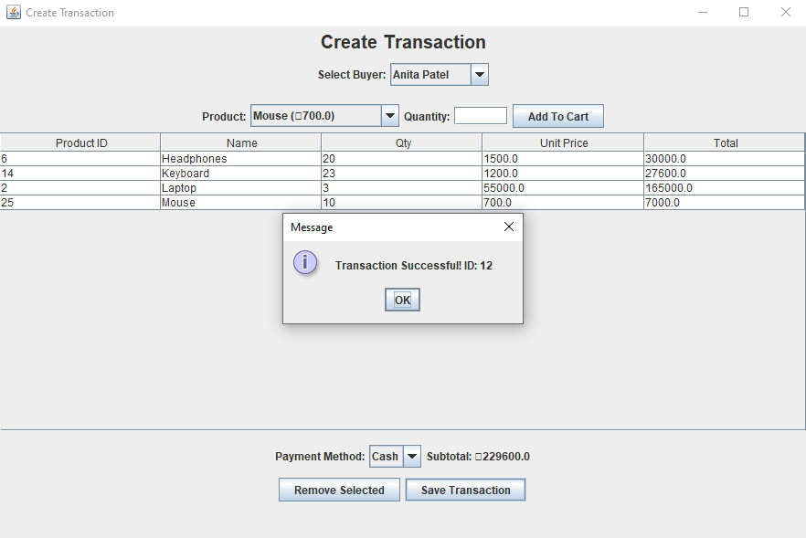
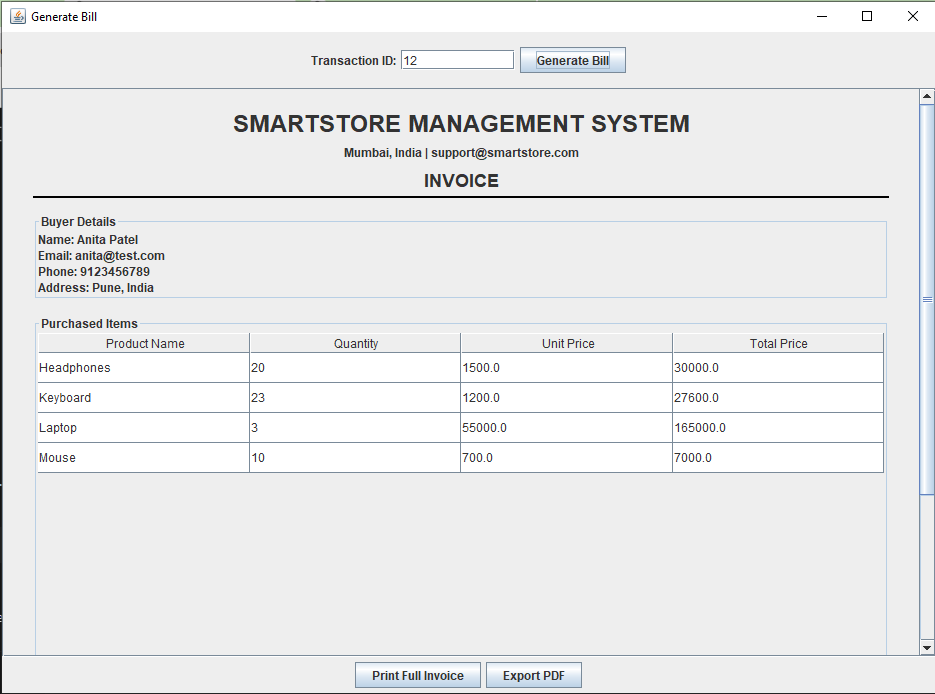
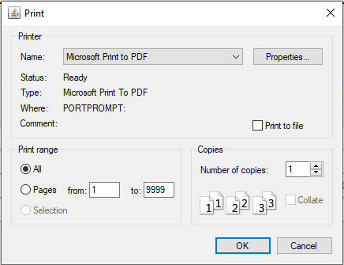
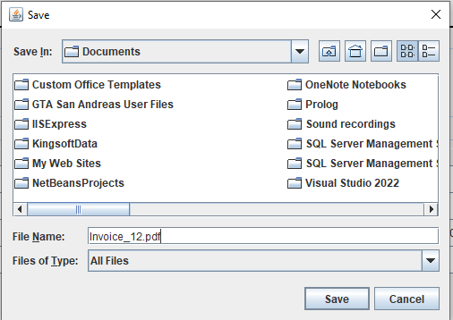
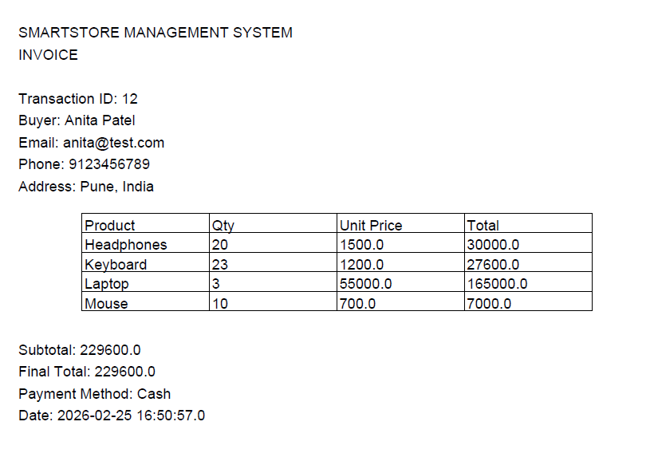

---

# 🧾 Task 7 – Generating the Bill

**SmartStore Management System**

## 📌 Overview

Task 7 implements a complete Bill Generation Module for the SmartStore Management System using:

* Java (Swing)
* JDBC
* MySQL
* iText (PDF Export)

This feature allows users to generate structured invoices for completed transactions, preview them in a professional layout, print them, and export them as PDF files.

## 🎯 Objective

The objective of Task 7 is to:

* Generate a bill for a completed transaction.
* Display buyer and product details clearly.
* Calculate subtotal and final total (without tax or discounts).
* Provide preview, print, and PDF export functionality.
* Allow searching for transactions by Transaction ID.

## 🗂️ Database Structure Used

The billing system works on top of the existing transaction system.

### Tables Used

**1️⃣ buyers**

* id
* name
* email
* phone
* address

**2️⃣ products**

* id
* name
* price
* quantity

**3️⃣ transactions**

* transaction_id
* buyer_id
* payment_method
* purchase_date

**4️⃣ transaction_items**

* id
* transaction_id
* product_id
* quantity
* unit_price

## 🏗️ Architecture

The implementation follows a structured MVC-style design:

```text
inventoryManagementSystem
│
├── model
│   ├── Bill.java
│   ├── BillItem.java
│
├── dao
│   ├── BillDAO.java
│
├── ui
│   ├── GenerateBillForm.java

```

## ⚙️ How It Works

### 1️⃣ Search Transaction

* User enters a Transaction ID
* System fetches:
* Buyer details
* Purchased products
* Payment method
* Purchase date


* Using SQL JOIN queries.

### 2️⃣ Bill Preview (Invoice Layout)

The invoice layout includes:

**🏢 Header Section**

* Company Name
* Company Address
* Invoice Title

**👤 Buyer Details**

* Name
* Email
* Phone
* Address

**📦 Purchased Items Table**

| Product Name | Quantity | Unit Price | Total Price |
| --- | --- | --- | --- |


*Total per item is calculated as:* `Total = Quantity × Unit Price`

**💰 Summary Section**

* Subtotal
* Final Total (No tax, No discount)
* *Final Total = Subtotal*

**🧾 Transaction Details**

* Transaction ID
* Purchase Date
* Payment Method

## 🖨️ Print Feature

* Prints the entire invoice layout
* Uses Java `PrinterJob`
* Compatible across JDK versions

## 📄 Export as PDF

Implemented using iText Library.

**PDF Includes:**

* Company header
* Buyer details
* Product table
* Subtotal and Final Total
* Payment Method
* Purchase Date
* Transaction ID

**PDF file name format:** `Invoice_<TransactionID>.pdf`

## 🔍 Features Implemented

* ✔ Structured invoice preview
* ✔ Clean professional UI layout
* ✔ Search by Transaction ID
* ✔ Buyer details display
* ✔ Product breakdown table
* ✔ Subtotal & Final total calculation
* ✔ Print invoice
* ✔ Export invoice as PDF
* ✔ Database-driven billing
* ✔ Error handling for invalid transaction

## 🛠️ Technologies Used

* Java Swing (UI)
* JDBC
* MySQL
* iText PDF Library
* NetBeans IDE

## 🧮 Business Logic

* No tax calculation
* No discounts applied
* No bill number generation
* Unit price stored at transaction time (prevents price-change issues)
* Database transaction integrity maintained

## 🚀 How to Run

1. Ensure MySQL server is running.
2. Import database schema.
3. Add iText JAR file to project libraries.
4. Run `LoginForm.java`.
5. Create a transaction.
6. Navigate to **Generate Bill**.
7. Enter Transaction ID.
8. Preview / Print / Export PDF.

## 📌 Task Compliance Summary

| Requirement | Status |
| --- | --- |
| Buyer Details Display | ✅ Completed |
| Product Table | ✅ Completed |
| Subtotal Calculation | ✅ Completed |
| Final Total (No Tax/Discount) | ✅ Completed |
| Transaction Details | ✅ Completed |
| Preview Option | ✅ Completed |
| Print Option | ✅ Completed |
| Export as PDF | ✅ Completed |
| Search Functionality | ✅ Completed |

## 🎓 Learning Outcomes

Through this task:

* Implemented multi-table JOIN queries
* Built structured invoice layout in Swing
* Managed database-driven billing logic
* Integrated third-party PDF library
* Applied proper UI structuring
* Followed clean DAO architecture

---

## 📷 Screenshots – Task 7 Output

Below are the screenshots demonstrating the complete flow of Task 7 – Bill Generation Module.

---

### 1️⃣ Login Success


Successful login before accessing the billing system.

---

### 2️⃣ Dashboard View


SmartStore dashboard showing navigation options including Create Transaction and Generate Bill.

---

### 3️⃣ Product Management View


Product management interface displaying available products.

---

### 4️⃣ Transaction Creation Success


Transaction successfully created with generated Transaction ID.

---

### 5️⃣ Generated Invoice Output


Structured invoice preview displaying buyer details, purchased items, subtotal, final total, and transaction details.

---

### 6️⃣ Print Functionality


Print dialog confirming full invoice print functionality.

---

### 7️⃣ PDF Save Dialog


Save dialog shown during invoice export process.

---

### 8️⃣ Exported PDF Output


Final exported invoice PDF displaying complete billing information.

---

> 📌 Note:
> For Product Management and Buyer Management features, please refer to Task 5 and Task 6.

## 📦 Conclusion

Task 7 successfully implements a fully functional and professional billing system inside the SmartStore Management System.

The solution is:

* Clean
* Structured
* Database-driven
* Evaluation-ready
* Internship-level complete

---
