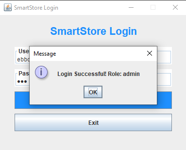
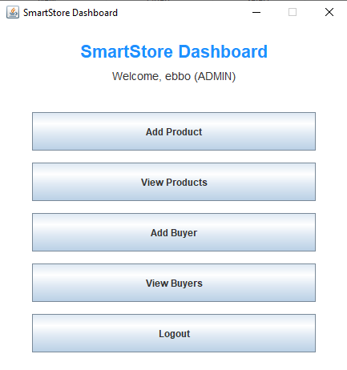
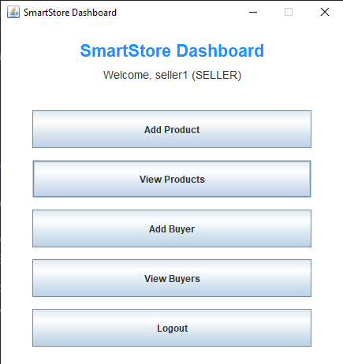
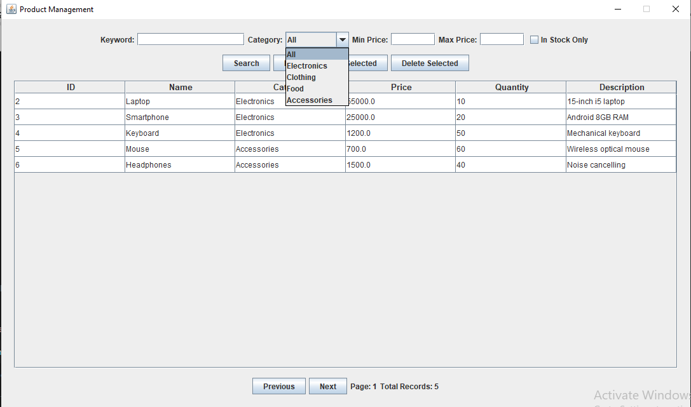
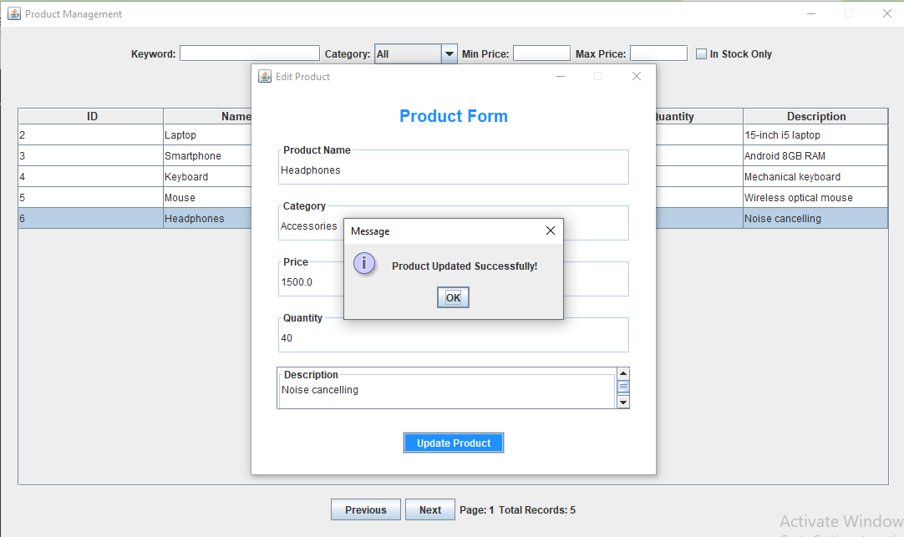
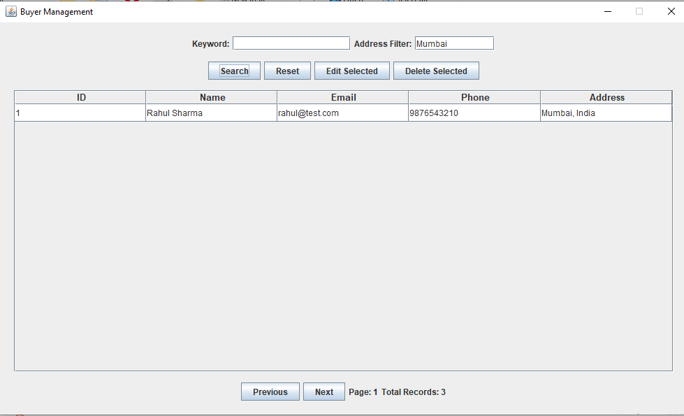
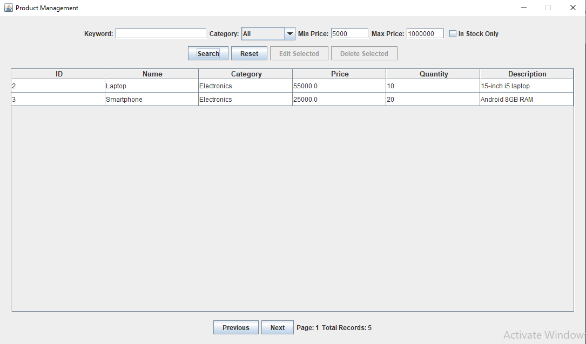

# Task 6 – Update & Search Products/Buyers  
SmartStore Inventory Management System

## 📌 Overview

Task 6 enhances the SmartStore system by implementing advanced record management features including:

- Updating Products and Buyers
- Advanced Search with Filters
- Pagination Support
- Role-Based Access Control (Admin/Seller)

This task improves data accuracy, usability, and scalability of the system.

---

# 🔄 Updating Products & Buyers

## ✅ Select Record
- Users can select a record from the table.
- "Edit Selected" button opens a pre-filled form.
- Only one record can be edited at a time.

## ✅ Populate Form
- Existing data is auto-loaded into the form.
- Reduces manual re-entry errors.
- Supports both Add and Update modes dynamically.

## ✅ Edit Validation
- Mandatory fields validated.
- Email format validated for Buyers.
- Price and Quantity validated for Products.
- Prevents negative values.

## ✅ Save Changes
- Update queries executed via DAO layer.
- Clean separation of UI and database logic.
- Form closes automatically after successful update.

## ✅ User Feedback
- Success messages shown via JOptionPane.
- Error messages shown if validation or DB operation fails.

---

# 🔎 Advanced Search Implementation

## 🔍 Search Bar
- Keyword-based search.
- Case-insensitive matching.
- Supports partial matches.
- Search by:
  - Product name
  - Category
  - Buyer name
  - Email
  - Address
  - ID

## 🎯 Filters

### Product Filters:
- Category dropdown
- Minimum price
- Maximum price
- In-stock checkbox

### Buyer Filters:
- Address filter
- Keyword filter

Supports multi-filter combinations.

---

# 📄 Pagination

- Page size: 10 records per page
- Previous / Next navigation
- Total record counter displayed
- Offset-based SQL pagination
- Handles large datasets efficiently

---

# 🔐 Role-Based Access Control (RBAC)

## Roles:
- Admin
- Seller

### Admin Permissions:
- Add
- View
- Search
- Edit
- Delete

### Seller Permissions:
- Add
- View
- Search
- ❌ Cannot Edit
- ❌ Cannot Delete

Buttons automatically disabled based on role.

Role is fetched during login and passed through:
LoginForm → HomePage → ViewForms

---

# 🏗 Architecture Used

- MVC Pattern
- DAO Layer for database operations
- Swing UI for frontend
- MySQL Database
- PreparedStatement for security

---

# 🧠 Key Learning Outcomes

- Implemented dynamic search queries
- Built multi-filter SQL queries
- Added pagination using LIMIT & OFFSET
- Designed update form reuse (Add/Edit)
- Implemented role-based permission control
- Improved user workflow efficiency

---

## 📸 Screenshots

### 🔐 Login

### 🧑‍💼 Admin Dashboard

### 🛍 Seller Dashboard

### 🔎 Product Search & Filters

### ✏️ Edit Product

### 👥 Buyer Search

### 🔒 Role-Based Restriction

# 🚀 Status

✅ Task 6 Completed Successfully  