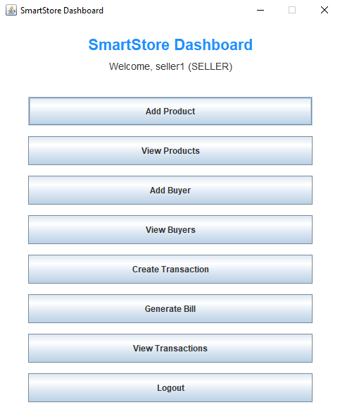
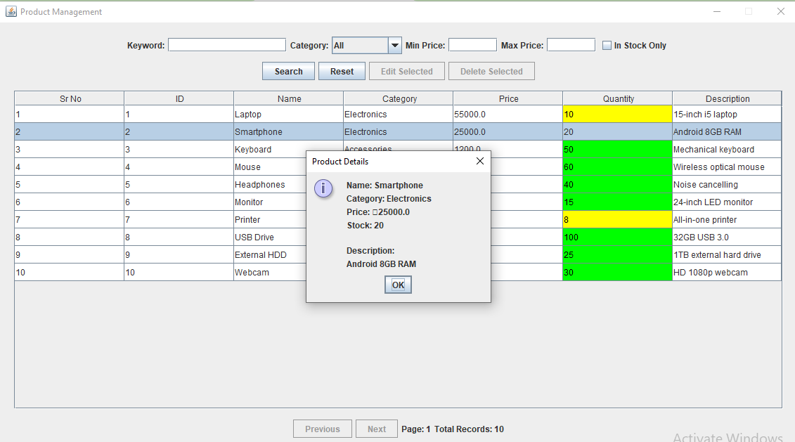
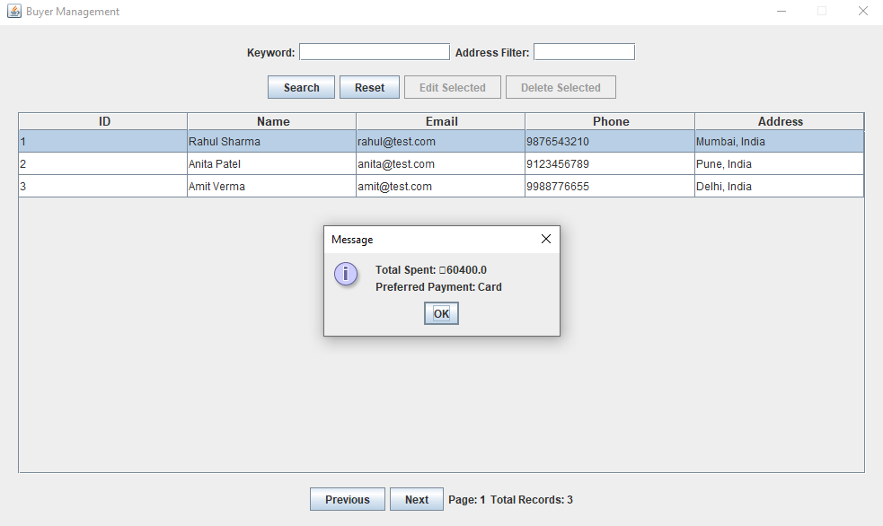
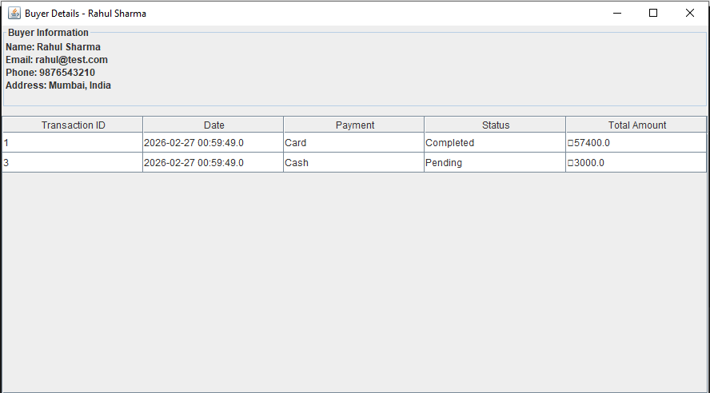
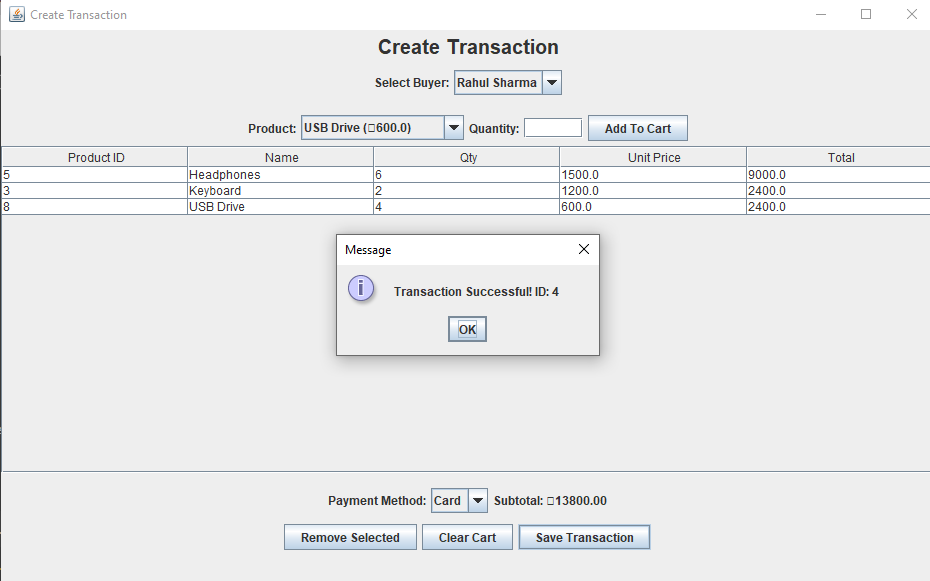
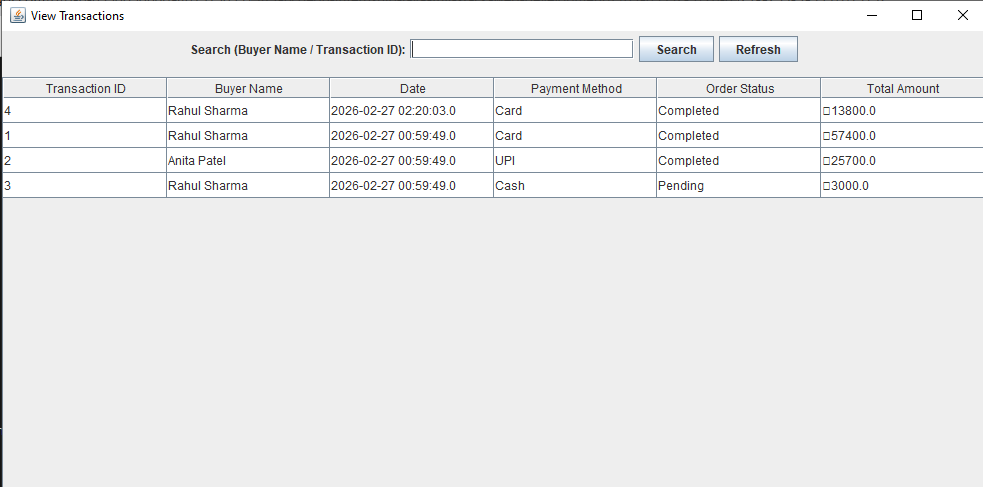
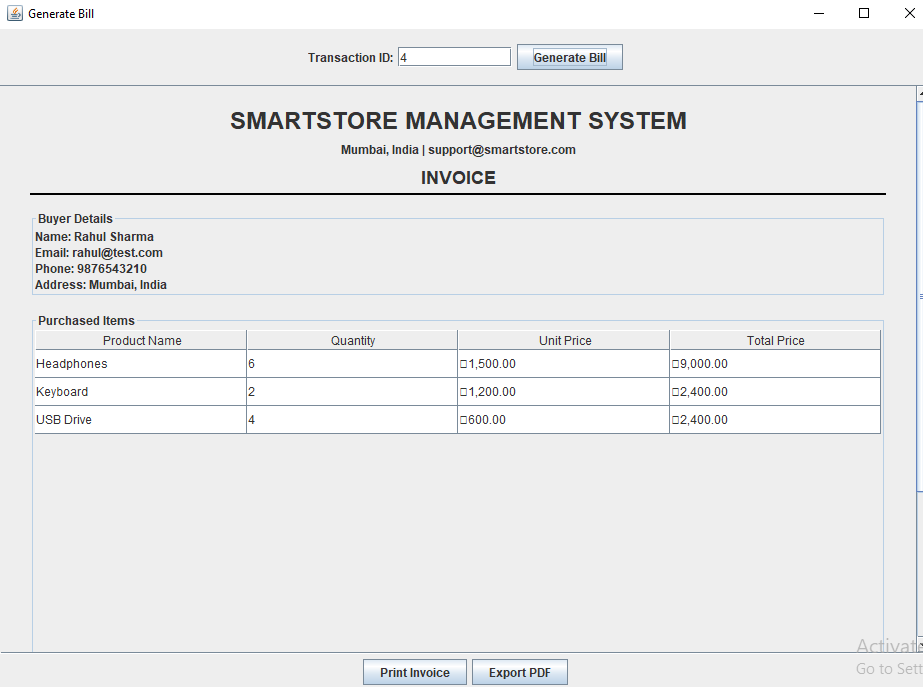

# 🛒 SmartStore Management System  
## 📊 Task 8 – Viewing Details of Buyers, Products & Transactions

Java Swing + MySQL Desktop Application

---

## 📌 Project Overview

SmartStore Management System is a Java Swing-based desktop application connected to a MySQL database.

This repository submission focuses on:

> **Task 8 – Structured Viewing & Reporting Interface**

Task 8 required implementing an organized, searchable, sortable, and user-friendly interface for viewing:

- 👤 Buyers
- 📦 Products
- 💳 Transactions

Task 7 (Bill Generation) was implemented previously and is integrated into the Transactions module.

---

# 🏗️ Technology Stack

| Layer        | Technology |
|-------------|------------|
| Frontend     | Java Swing |
| Backend      | JDBC |
| Database     | MySQL |
| Architecture | MVC Pattern |

---

# 📸 Screenshots (Task 8 Implementation)

---

## 🏠 Dashboard (Seller View)



**Feature:** Role-based dashboard providing access to Buyers, Products, Transactions, and Bill modules.

---

## 📦 Product Management – View Products



**Features Implemented:**
- Structured table view
- Keyword search
- Category filter
- Min/Max price filter
- In-stock filter
- Pagination (10 per page)
- Column sorting
- Double-click detailed popup

---

## 👤 Buyer Management – View Buyers



**Features Implemented:**
- Search by name/email/phone/ID
- Address filter
- Pagination
- Sorting enabled
- Role-based edit/delete control

---

## 📊 Buyer Detailed Profile



**Features Implemented:**
- Complete buyer information
- Transaction history
- Total amount spent
- Preferred payment method

---

## 💳 Create Transaction (Integrated Module)



**Features:**
- Add products to cart
- Real-time subtotal calculation
- Payment method selection
- Transaction save confirmation

*(Task 7 integration for bill generation)*

---

## 📋 View Transactions



**Features Implemented:**
- View all transactions
- Search by buyer name
- Search by transaction ID
- Sorting by all columns
- Order status display

---

## 🧾 Generate Bill (Integrated from Task 7)



**Features:**
- Invoice view by Transaction ID
- Buyer details display
- Purchased items table
- Print option
- Export to PDF

---

# 👤 Buyers Module – Task 8 Requirements

✔ Structured table view  
✔ Registration date (created_at used)  
✔ Search & filter options  
✔ Sorting functionality  
✔ Pagination  
✔ Detailed profile view  
✔ Role-based restrictions  

---

# 📦 Products Module – Task 8 Requirements

✔ Organized product table  
✔ Advanced filtering system  
✔ Sorting enabled  
✔ Pagination implemented  
✔ Detailed popup view  
✔ Role-based edit/delete  

---

# 💳 Transactions Module – Task 8 Requirements

✔ View transaction list  
✔ Search functionality  
✔ Sorting enabled  
✔ Order status tracking  
✔ Integration with Bill Generation  

---

# 🔄 Changes Made to Support Task 8

| Enhancement | Purpose |
|------------|----------|
| Added `ViewTransactionsForm` | Required by Task 8 |
| Added `BuyerDetailsForm` | Detailed buyer profile |
| Implemented filtering logic | Improved data accessibility |
| Enabled JTable RowSorter | Sorting functionality |
| Added pagination logic | Organized viewing |
| Used `created_at` as registration date | Task 8 compliance |
| Improved UI structure | Professional presentation |

---

# 🔐 Role-Based Access Control

| Role   | Permissions |
|--------|------------|
| Admin  | Full CRUD access |
| Seller | View-only (no edit/delete) |

---

# 🗄️ Database Used

Database Name: `store_db`

Tables:
- users
- products
- buyers
- transactions
- transaction_items

Includes:
- Foreign keys
- Cascading deletes
- Indexes for performance

---

# 🚀 How To Run

1. Import the SQL script into MySQL.
2. Configure database credentials in `DBConnection.java`.
3. Run `LoginForm.java`.

### Admin Login
```
Username: ebbo
Password: 123
```

### Seller Login
```
Username: seller1
Password: 123
```

---

# 🎯 Task 8 Completion Status

| Feature | Status |
|----------|--------|
| Buyers Viewing | ✅ Completed |
| Products Viewing | ✅ Completed |
| Transactions Viewing | ✅ Completed |
| Filtering | ✅ Implemented |
| Sorting | ✅ Implemented |
| Pagination | ✅ Implemented |
| Detailed Views | ✅ Implemented |

---

# 📌 Conclusion

Task 8 has been successfully implemented with:

- Structured data presentation
- Advanced filtering & sorting
- Pagination
- Detailed profile views
- Role-based access control
- Professional UI layout
- Integration with Bill Generation module

The system meets all Task 8 requirements and is ready for academic submission.

---